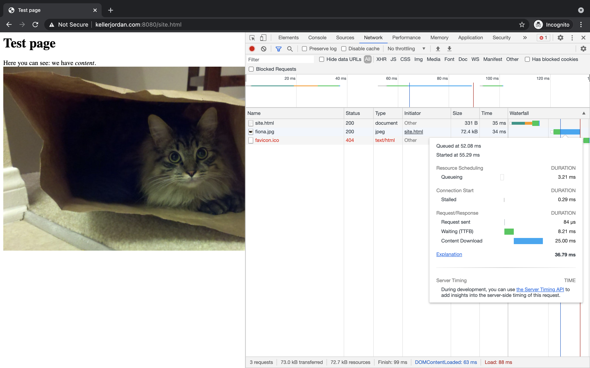

# C-http-server
An implementation of a simple HTTP server in C. The entire thing is in `server.c`.

To build and run the server, just do
```
make run
```
This will run the server with default settings:
* on port 8000
* serving from `docs` as root directory
* printing errors to console and piping output to `out.log`

I am running the server on a new AWS `t2.micro` instance running Amazon Linux 2.

The directory `docs` contains several example files and directories. Try reading the server logs after submitting the form at `docs/form.html`.

The project approximately follows Swarthmore's [CS43 Lab 2](https://www.cs.swarthmore.edu/~kwebb/cs43/f17/labs/lab2.html).

## Screenshots





If you have the server exposed on the internet, you get to see some odd requests.


